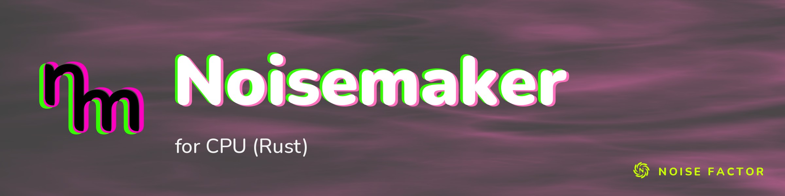

<!-- repo-hero -->
<a href="https://noisemaker.app/"></a>

<sub>Open source from <a href="https://noisefactor.io">Noise Factor</a> &middot; <a href="https://github.com/noisefactorllc">more projects</a></sub>

# Noisemaker for Rust

> This package supports the "Export Shader Pipeline" feature in Noisedeck.app. The feature runs shader compositions on other platforms. Noise Factor derives this package from the upstream Noisemaker Engine project and tests it for pixel-level parity.

Noisemaker for Rust is a standalone CPU renderer for Noisemaker's generated
effect catalog. The Cargo package and command are named `noisemaker-for-rust` and `noisemaker-rs`. Rust code imports the library as `noisemaker_cpu`.

The renderer contains the catalog and typed shader IR at compile time. Normal
library and CLI rendering does not invoke JavaScript, Node.js, Python, a browser,
a GPU, the network, FFI, or a runtime shader compiler.

## Build and install

Rust 1.85 or newer is required.

```sh
cargo build --release
cargo install --path .
```

## Library API

Render one catalog effect with its defaults:

```rust
use std::collections::BTreeMap;
use noisemaker_cpu::{ParamValue, RenderOptions, Surface, render_effect};

let options = RenderOptions { width: 256, height: 256, ..Default::default() };
let image = render_effect(
    "synth/gradient",
    &BTreeMap::<String, ParamValue>::new(),
    &BTreeMap::<String, Surface>::new(),
    &options,
)?;
# Ok::<(), Box<dyn std::error::Error>>(())
```

Or render a full DSL program:

```rust
use noisemaker_cpu::{CpuRenderer, RenderOptions};

let mut renderer = CpuRenderer::new()?;
let result = renderer.render(
    "search synth,classicNoisedeck,filter; gradient().kaleido(sides: 8).vignette().write(o0)",
    &RenderOptions { width: 256, height: 256, ..Default::default() },
)?;
# Ok::<(), Box<dyn std::error::Error>>(())
```

Runnable versions are in `examples/render_effect.rs` and
`examples/render_dsl.rs`. They write to `NOISEMAKER_OUTPUT` when set and
otherwise choose an untracked temporary path.

## Command line

The CLI has seven commands:

```text
noisemaker-rs generate EFFECT [OPTIONS]
noisemaker-rs apply EFFECT INPUT.png [OPTIONS]
noisemaker-rs animate EFFECT [OPTIONS]
noisemaker-rs run [PROGRAM|-] [OPTIONS]
noisemaker-rs render PROGRAM|- [OPTIONS]
noisemaker-rs effect EFFECT [OPTIONS]
noisemaker-rs effects
```

`generate` renders an image generator. It also accepts `random` as the effect. This deterministically selects from the sorted eligible generator pool using `--seed` and prints the resolved ID first. `apply` renders an image filter or
mixer at the input image dimensions. `run` reads DSL from a file or standard
input, and `render` is its compatibility alias. `effect` constructs a bounded,
meaningful program for any catalog domain. `effects` prints all 205 sorted
`ID<TAB>KIND` records.

Common options are:

```text
--width N           output width (default 512)
--height N          output height (default 512)
--time N            finite render time (default 0)
--seed N            signed deterministic seed (default 1)
--output PATH       output file; --filename is an alias
--input PATH        bind a PNG to imageTex and textTex
--texture NAME=PATH bind a named external PNG; repeatable
--param NAME=VALUE  override a catalog parameter; repeatable, last value wins
```

`animate` additionally accepts `--frame-count` (50), `--fps` (30), `--speed`
(1), and `--save-frames DIR`. It calls `ffmpeg` directly with literal arguments.
If `ffmpeg` is absent, saved frames remain usable. Without `--save-frames`, the command fails with installation guidance.

PNG and MP4 destinations are created through exclusive, unpredictable sibling
temporary files and renamed only after successful encoding. A failed command
preserves any pre-existing destination and removes only its own temporary file.
Width times height is limited to 16,777,216 pixels.

## Catalog and execution model

The catalog contains 205 CPU effects across image, volume, particle, renderer,
and loop domains. Five upstream effects are intentionally excluded because they
depend on media/runtime interfaces absent from this standalone CPU port:
`render/meshLoader`, `render/meshRender`, `synth/roll`, `synth/scope`, and
`synth/spectrum`. The complete generated inventory and the 456 non-null
compile-time choices are listed in [docs/EFFECTS.md](docs/EFFECTS.md).

External-texture effects require `--input` or a matching `--texture` binding.
Volume work scales cubically with `volumeSize`. Iterated effects default to 60
steps, so large canvases can be expensive on a scalar CPU renderer. Particle filters are meaningful inside a `pointsEmit`/state/`pointsRender` chain. The `effect` command constructs that owner path automatically. Loop markers must be
paired around the repeated chain.

Coordinates are normalized with the origin at the lower left inside shader
execution while `Surface` and PNG rows are stored top-down. Colors are linear
floating-point RGBA internally and clamp/round to RGBA8 during PNG encoding.

Overlay texture generation is cached by a bounded least-recently-used CPU
cache. `RenderOptions::one_shot` selects Initial or Ready one-shot semantics. Ready is the public default.

Four programs use complete native fragment replacements for semantics that the
generic typed IR cannot represent directly. Snow uses an exact-key float32
semantic adapter to preserve the JavaScript CPU port's operation boundaries.
CRT remains on typed IR but selects one exact-key builtin-semantic adapter for its reduced-turn float32 sine. This matches the JavaScript CPU port without changing `sin` for any other shader. Temporal Aberration preserves the JavaScript factory's current true-branch assignment quirk behind its exact program key. Ordinary typed-IR conditional assignments retain their standard behavior.
The canonical `hash_uint(uint)` helper uses the JavaScript CPU compiler's source-compatibility hash at its exact mangled function target. Differently named user functions continue to execute their typed-IR bodies.

Compact CSL syntax is deliberately not implemented. Use the documented chained
DSL, whose parser provides source locations and catalog-aware validation.

## Regeneration and parity

The checked-in bundle is generated from locked Noisemaker metadata and shader
sources. Verify canonical generated files and the generated effect reference:

```sh
PYTHONDONTWRITEBYTECODE=1 python3 scripts/generate_bundle.py --check
```

Supplying `--source PATH` rebuilds from a source tree containing
`metadata.json`, `bundle-lock.json`, and `effects.json` or `effects/`. Existing shader hashes are immutable. There is no update-lock mode. The packaged
maintainer generator includes its complete `scripts/transpiler` dependency.

Cross-language maintenance parity compares one shared DSL program through the
built Rust and JavaScript CLIs. It writes exactly one sorted record for every catalog effect and requires exact RGBA8 bytes (zero tolerance). It reports every unsupported interface with a stable reason. It treats timeouts or render errors as failures:

```sh
python3 scripts/parity.py \
  --rust target/release/noisemaker-rs \
  --js ../noisemaker-for-cpu/bin/noisemaker-cpu.js
```

Use `--only ID`, `--timeout SECONDS`, and `--json PATH` for focused or
machine-readable runs. JavaScript is an offline test oracle only. It is never a production runtime dependency.

## Contributing and security

Focused contributions are welcome. See [CONTRIBUTING.md](CONTRIBUTING.md) for
the complete local verification commands and [CODE_OF_CONDUCT.md](CODE_OF_CONDUCT.md)
for participation expectations. Report suspected vulnerabilities privately as
described in [SECURITY.md](SECURITY.md), not in a public issue.

## License and trademark

Code is available under the MIT License. See `TRADEMARK.md` for trademark use.
